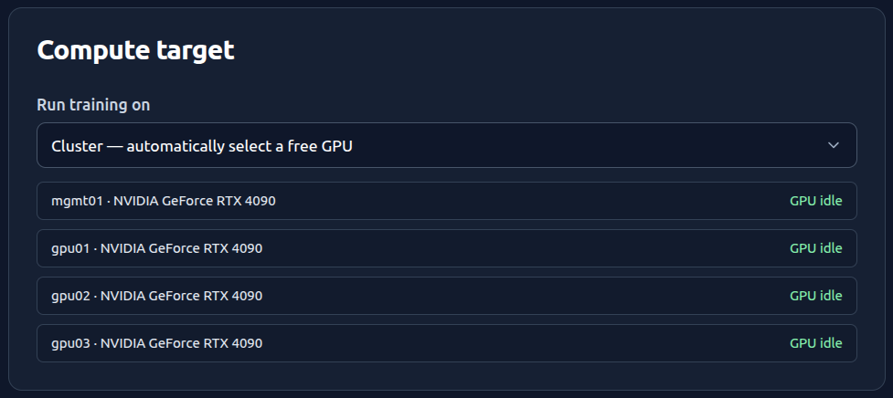

# 机器人数据平台部署包

[English](README.md) | **简体中文**

本仓库用于部署一套小型机器人训练平台：QNAP 提供共享数据，`mgmt01` 同时承担管理面和一张 GPU，其余节点提供更多 GPU，Slurm 负责调度，leLab 提供训练 Web。

部署完成后，leLab 会把四张 GPU 汇总成一个计算目标，训练任务可以交给 Slurm 自动挑选空闲 GPU，也可以指定节点：



当前站点拓扑以 `config/site.env.example` 为准：

| 主机 | 角色 | 地址 | SSH 登录账号 | 需要安装 |
|---|---|---|---|---|
| `mgmt01` | 管理机、Slurm Controller、GPU Worker、leLab | `192.168.100.202` | 本机，不 SSH | `10`、`25`、Controller 配置、`15` |
| `gpu01` | GPU Worker | `192.168.100.215` | `snorlax` | `20`、`25`、Worker 配置 |
| `gpu02` | GPU Worker | `192.168.100.216` | `yang` | `20`、`25`、Worker 配置 |
| `gpu03` | GPU Worker | `192.168.100.217` | `snorlax` | `20`、`25`、Worker 配置 |
| QNAP | NFS 存储 | `192.168.100.184:/robot_platform` | — | 仅配置共享与权限 |

**Slurm NodeName 和 SSH 登录账号是两个不同的东西，不能互相替代。** 节点的 Slurm 名称是 `gpu01`/`gpu02`/`gpu03`；SSH 目标是 `snorlax@192.168.100.215`、`yang@192.168.100.216`、`snorlax@192.168.100.217`。SSH 账号不必与 NodeName 相同，各节点之间也不必相同（上表中 `gpu02` 就与其他两台不同）。

已经在运行的集群要再加节点，不要重走首次部署流程，看 [向已有集群增加 GPU 节点](docs/09-add-gpu-node.zh-CN.md)。

## 从这里开始

首次部署请严格按下面顺序执行。不要根据脚本编号猜执行顺序：`15-install-lelab-platform.sh` 虽然编号较小，但必须在所有机器的 Slurm 和训练环境都完成后执行。

```text
0. 所有主机核对 site.env、主机名、驱动、网络和时间
1. QNAP 建共享目录并授权全部节点 IP
2. 所有主机安装 /etc/hosts 托管块
3. mgmt01 安装管理机基础组件、MLflow 和训练环境
4. 每台 GPU Worker 安装 Worker 基础组件和训练环境
5. 所有主机统一安装支持 cgroup v2 的 Slurm 26.05.2
6. mgmt01 渲染 Slurm 配置；分别安装 Controller/Worker 配置
7. 逐节点完成 GPU smoke test
8. mgmt01 安装 leLab，配置到每台 Worker 的 SSH 探测
9. 检查 API，放入一份小数据集，提交第一条短训练任务
```

下面几处顺序不能调换，否则失败现象不指向真正原因：

- 第 5 步必须在第 3、4 步之后。角色脚本会先装上 Ubuntu 自带的旧 Slurm，最终版本以 26.05.2 为准。
- 第 6 步必须在第 5 步之后，且要等**所有**节点都装完 Slurm、都跑过 `slurmd -C`，因为渲染需要每台的真实硬件参数。
- 第 8 步必须在第 7 步之后。leLab 安装脚本会检查 `sbatch`/`sinfo` 可用。

对应文档：

| 阶段 | 文档 |
|---|---|
| QNAP | [QNAP NAS 配置](docs/01-qnap-nas.zh-CN.md) |
| 管理机 | [管理机安装](docs/02-management-node.zh-CN.md) |
| GPU Worker | [GPU 节点安装](docs/03-gpu-node.zh-CN.md) |
| Slurm 26.05.2 DEB | [Slurm 26.05.2 安装](docs/Slurm-INSTALL.zh-CN.md) |
| Slurm 配置和验收 | [Slurm 集群收尾](docs/06-cluster-finalization.zh-CN.md) |
| leLab | [leLab 集群 Web](docs/07-lelab-cluster-web.zh-CN.md) |
| **扩容：加 GPU 节点** | [向已有集群增加 GPU 节点](docs/09-add-gpu-node.zh-CN.md) |
| 常见错误 | [安装与运行排障](docs/08-troubleshooting.zh-CN.md) |
| 可选采集节点 | [采集节点](docs/04-collector-node.zh-CN.md)、[采集与 GPU 合并节点](docs/05-combined-node.zh-CN.md) |

## 部署前约定

每台 Linux 主机都应满足：

- 当前已验证环境为 Ubuntu 22.04，使用静态 IP并禁止自动休眠；
- 仓库已复制到本机，并从仓库根目录执行命令；
- NVIDIA 驱动已经安装，`nvidia-smi` 正常；
- 能访问 QNAP TCP 2049、管理机 TCP 6817，管理机能访问 Worker TCP 6818；
- 系统时间已同步；
- `robot-train` 的 UID 和 `robotdata` 的 GID 在**所有**节点上是同一个数字；
- 使用 Slurm 26.05.2，且 `stat -fc %T /sys/fs/cgroup` 输出 `cgroup2fs`。

UID/GID 用 `id robot-train` 和 `getent group robotdata` 在每台核对。数字不一致时，作业能调度成功但写 NAS 时权限错误，现象与 NFS 配置问题相同，很难定位。

脚本不会安装或升级 NVIDIA 驱动，也不会格式化磁盘。

角色脚本允许 Ubuntu 24.04，但仓库内 Slurm DEB 是为 Ubuntu 22.04 Jammy 构建的，不能直接假定可用于 24.04。24.04 应单独准备与系统 ABI 匹配的同版本包。

## 0. 准备统一配置

在每台主机分别执行：

```bash
cp config/site.env.example config/site.env
editor config/site.env
```

所有主机的以下字段必须完全一致：

```text
MANAGEMENT_HOST
MANAGEMENT_IP
NAS_IP
NAS_EXPORT
NAS_MOUNT
GPU_NODE_NAMES
GPU_NODE_IPS
DATA_GROUP
DATA_GID
TRAIN_USER
TRAIN_UID
TRAIN_ENV_ROOT
LEROBOT_GIT_REF
```

当前四节点值应为：

```bash
GPU_NODE_NAMES="mgmt01 gpu01 gpu02 gpu03"
GPU_NODE_IPS="192.168.100.202 192.168.100.215 192.168.100.216 192.168.100.217"
```

两个列表按位置一一对应，长度必须相同，否则 `05-configure-hosts.sh` 会报 `GPU_NODE_NAMES and GPU_NODE_IPS have different lengths`。

不要提交 `config/site.env`。它是本地活动配置，已被 Git 忽略。**这也意味着换机器或重装后它不会自动恢复**，拓扑变更请同时更新 `config/site.env.example`。

在每台主机上设置对应主机名，然后重新登录。主机名必须与将要写入 `nodes.conf` 的 Slurm NodeName 完全一致：

```bash
sudo hostnamectl set-hostname mgmt01   # 只在 mgmt01
sudo hostnamectl set-hostname gpu01    # 只在 gpu01，其余节点类推
```

所有主机都执行：

```bash
sudo ./scripts/05-configure-hosts.sh --apply
getent hosts mgmt01 gpu01 gpu02 gpu03
```

`05` 只管理 `/etc/hosts` 中带 `robot-platform` 标记的块。它有两种停止情况：

- 块外已存在同名条目 → 停止，要求人工处理；
- 托管块已存在但与目标不一致（例如后来加了节点）→ 停止并提示 `existing managed /etc/hosts block differs`。

**该脚本不做增量修改。** 拓扑变更时要先删除旧块再重新生成，步骤见[向已有集群增加 GPU 节点](docs/09-add-gpu-node.zh-CN.md#3-重建-etchosts-托管块)。

## 1. 准备 QNAP

先完成 [QNAP NAS 配置](docs/01-qnap-nas.zh-CN.md)。至少应存在：

```text
/mnt/robot_platform/datasets
/mnt/robot_platform/jobs
/mnt/robot_platform/mlflow-artifacts
```

QNAP 的 NFS 白名单必须包含**全部**节点 IP：`192.168.100.202`、`192.168.100.215`、`192.168.100.216`、`192.168.100.217`。加节点时容易漏掉这一步，现象是新节点挂载失败或只读。当前试点使用 `all_squash` 时，应给 QNAP guest 账号共享目录读写权限。

## 2. 安装 mgmt01

以下命令只在 `mgmt01` 执行：

```bash
./scripts/00-audit-host.sh management
sudo ./scripts/10-install-management.sh --apply
sudo ./deploy/management/bootstrap.sh --apply
sudo ./scripts/25-install-training-environment.sh --apply
```

Ubuntu 22.04 默认 Python 3.10，而当前 LeRobot 需要 Python 3.12。若本机还没有 `python3.12`，先按 [管理机安装](docs/02-management-node.zh-CN.md)中的说明安装。

`10` 会生成集群唯一的 `/etc/munge/munge.key`。不要重新生成第二份，也不要放进 Git、NAS 或聊天记录。

## 3. 安装每台 GPU Worker

以下命令在 `gpu01`、`gpu02`、`gpu03` 上分别执行：

```bash
./scripts/00-audit-host.sh gpu
sudo ./scripts/20-install-gpu-node.sh --apply
sudo ./scripts/25-install-training-environment.sh --apply
```

确认本地目录存在：

```bash
sudo -u robot-train test -d /cache/datasets
sudo -u robot-train test -d /cache/exports
sudo -u robot-train test -d /work/runs
sudo -u robot-train test -w /var/lib/robot-platform/cache
```

最后一项是 `LELAB_JOB_CACHE_ROOT`，**必须在每台 Worker 上存在且 `robot-train` 可写**。Slurm 会把 `HOME` 指向 `robot-train` 的家目录，而它在 Worker 上并不存在，缓存到 `~` 的作业会在该节点失败。缺失时补建：

```bash
sudo install -d -o robot-train -g robotdata -m 0750 /var/lib/robot-platform/cache
```

## 4. 安装并配置 Slurm

Ubuntu 22.04 仓库自带的旧 Slurm 不适合作为本项目最终版本。基础角色脚本执行完成后，在所有主机安装相同的 Slurm 26.05.2 DEB，步骤见 [Slurm 26.05.2 安装](docs/Slurm-INSTALL.zh-CN.md)。

然后按 [Slurm 集群收尾](docs/06-cluster-finalization.zh-CN.md)完成：

1. 所有主机收集真实 `sudo slurmd -C`；
2. `mgmt01` 填写 `config/slurm/nodes.conf`，每台一行；
3. 渲染并审查 `config/slurm/slurm.conf.generated`；
4. `mgmt01` 安装 Controller 配置；
5. 安全复制 Munge 密钥和生成配置到每台 Worker；
6. 每台 Worker 使用本机真实路径安装 Worker 配置；
7. 验证全部节点都为 `idle`，并逐节点运行一张 GPU 的 smoke test。

两个反复出错的细节：

- **`/etc/slurm/slurm.conf` 必须全集群逐字节一致。** 拓扑变化时，已有节点手里的旧配置也要一起换掉，只更新新节点会让已有节点失效。
- `/secure/temp/munge.key` 之类的路径只是文档占位符，不会自动创建。传给 `install-worker-config.sh` 的前两个参数必须是 **该 Worker 本机已经存在且 root 可读的文件**。

## 5. 安装 leLab

确认 `sinfo -N -l` 中全部节点均为 `idle`，并且每台机器的统一训练环境 GPU 测试都通过后，只在 `mgmt01` 执行：

```bash
sudo ./scripts/15-install-lelab-platform.sh --apply
```

安装前还需要：

- `mgmt01` 上有 Python 3.12；
- 发起 `sudo` 的普通用户有 Node.js 20.19 或更高版本及 npm；
- NAS 的 `datasets` 可读、`jobs` 可写；
- Slurm 命令可用。

安装脚本首次创建 `/etc/robot-platform/lelab.env`，以后重跑不会覆盖它。当前远程 SSH 用户应配置为：

```bash
LELAB_CLUSTER_NODES=mgmt01=192.168.100.202,gpu01=snorlax@192.168.100.215,gpu02=yang@192.168.100.216,gpu03=snorlax@192.168.100.217
```

这一行会很长。**用编辑器改，不要用 `sed` 一行命令**：终端粘贴时长命令会被折行，`sed` 收到不完整的表达式后报 `unterminated 's' command`。该文件由 systemd 以 `EnvironmentFile` 读取，改完必须 `sudo systemctl restart lelab-platform` 才生效。

SSH 密钥、host key 验证和检查命令见 [leLab 集群 Web](docs/07-lelab-cluster-web.zh-CN.md)。

## 6. 验收

角色验收：

```bash
# mgmt01
./scripts/90-validate-deployment.sh management

# 每台 GPU Worker
./scripts/90-validate-deployment.sh gpu
```

管理机上的关键检查：

```bash
scontrol ping
sinfo -N -l
scontrol show nodes

curl --noproxy '*' -fsS http://127.0.0.1:8000/health
curl --noproxy '*' -fsS http://127.0.0.1:8000/cluster/status | jq
curl --noproxy '*' -fsS http://127.0.0.1:8000/cluster/templates | jq
```

最终验收不是“服务为 active”，而是：

1. 每个节点都能被 Slurm 分配一张 GPU，且 `nvidia-smi -L` 返回**各不相同**的 GPU UUID（UUID 重复说明 `NodeAddr` 写错，两个 NodeName 指向了同一台物理机）；
2. leLab 能看到全部节点和显存，且 `eligible` 为 `true`；
3. NAS 中的小型 LeRobot 数据集能出现在页面；
4. 能提交一条短训练任务并生成日志与 checkpoint；
5. 中断后能从共享 checkpoint 恢复。

## 脚本行为和安全边界

- `00-audit-host.sh` 和 `90-validate-deployment.sh` 是只读检查；
- 其他安装脚本必须显式传入 `--apply`；
- 角色安装脚本会创建账号、目录、systemd 服务和 NFS 挂载；
- `15`、`25` 会访问 Python/Git/npm 软件源，耗时较长；
- `config/site.env`、`deploy/management/.env`、Munge 密钥、leLab SSH 私钥和 Token 均不得提交；
- 失败后可在修正原因后重跑相同步骤，但使用自建 Slurm DEB 后，重跑 `10`/`20` 前应先阅读 [Slurm 安装说明](docs/Slurm-INSTALL.zh-CN.md)中的版本保护提示。

## 在 `lerobot/` 子模块中开发 LeRobot

`lerobot/` 是一个 Git 子模块，指向 [Yingminj/lerobot_dev](https://github.com/Yingminj/lerobot_dev.git)，即 `huggingface/lerobot` 的 fork。它只是用来阅读和修改框架的开发副本，**不是**集群实际训练时使用的代码。训练作业跑在 `/opt/robot-platform/train-venv` 中，由 `25-install-training-environment.sh` 从 `LEROBOT_GIT_URL@LEROBOT_GIT_REF` 安装。子模块应保持在与 `LEROBOT_GIT_REF` 相同的提交上（当前为 `v0.6.0`），否则你写出的代码会依赖部署环境里并不存在的 API。

克隆时一并拉取子模块，或事后补齐：

```bash
git clone --recurse-submodules https://github.com/Yingminj/robot_data_platform.git
# 已经克隆但没有子模块内容：
git submodule update --init lerobot
```

在子模块内部，`origin` 是自己的 fork，`upstream` 是 `huggingface/lerobot`：

```bash
git -C lerobot remote -v
git -C lerobot fetch upstream      # 获取上游新版本
```

### 父仓库记录的是一个提交 ID，不是文件

在父仓库执行 `git add lerobot`，暂存的只是一个 40 位 SHA —— 子模块当前的 `HEAD`。它不会暂存 `lerobot/` 下任何文件的内容，父仓库的 `git commit` 也不会向 `lerobot_dev` 推送任何东西。这是两个仓库、两次互相独立的 push。

有两个后果值得记住，因为它们都不会主动报错：

- 修改了 `lerobot/` 下的文件后，在父仓库执行 `git add lerobot && git commit`，**什么都不会被记录**。子模块的 `HEAD` 没有移动，SHA 没有变化，这次提交是空的。
- 在子模块内提交但没有 push，就先在父仓库提交了指针，会得到一个引用了「只存在于这台机器上」的 SHA 的父提交。其他人（包括在另一个节点上的你自己）执行 `git submodule update` 时会看到 `fatal: reference is not a tree`。

因此顺序固定为：先内容，再发布，最后指针。

```bash
# 1. 内容，在子模块里提交
git -C lerobot add <files>
git -C lerobot commit -m "..."

# 2. 发布出去（新分支第一次 push 需要 -u）
git -C lerobot push -u origin dev

# 3. 到这一步才在父仓库记录新指针
git add lerobot && git commit -m "bump lerobot to ..."
```

与其靠记忆，不如让 Git 替你检查第 2 步：

```bash
git config --global push.recurseSubmodules check   # 或 on-demand，自动连带推送子模块
```

### 看懂状态输出

父仓库的 `git status` 用一个字符描述子模块，而这两个字符的含义完全不同：

| 输出 | 含义 | `git add lerobot` 会记录内容吗？ |
|---|---|---|
| `? lerobot` | 子模块内有未跟踪的文件 | 不会 —— `HEAD` 没有移动 |
| `M lerobot` | 子模块 `HEAD` 与已记录的指针不一致 | 会 —— 记录新的 SHA |

`git submodule status` 的表述更精确：前缀 `+` 表示当前检出已经偏离了被记录的提交，`-` 表示子模块尚未初始化，前缀为空格表示一致。

### 让改动真正生效到集群上

`lerobot_dev` 上的一次提交，本身不会改变 GPU 节点上的任何东西。有两条部署路径：

- **新策略 —— 用插件。** 将其打包成 `lerobot_policy_<name>` 发行包，在每个节点的 `train-venv` 里 `pip install -e`。`lerobot-train` 会自动导入所有带该前缀的已安装发行包，因此改完即生效，无需重装，也完全不必 fork LeRobot。在 `/etc/robot-platform/model-templates.json` 中登记后即可在 leLab 中选择，注意模板的 `id` 必须等于其 `policy_type`。
- **改框架本身 —— 重新部署版本锚点。** 给 fork 打 tag，把 `config/site.env` 中的 `LEROBOT_GIT_URL` 和 `LEROBOT_GIT_REF` 指向该 tag，然后在每个节点上重跑 `25-install-training-environment.sh --apply`。同时把子模块指针移到同一个 tag，让开发副本与部署环境保持一致。

## 当前不包含的功能

仓库目前没有完整的数据治理业务：

- H5 validator 和自动 QC Worker；
- 时间范围标注前端；
- 可运行的 Upload Agent；
- 正式训练数据和团队定制模型。

采集相关的 `30`/`40` 脚本只准备账号、目录和 systemd 模板，不代表采集链路已经可以投入使用。

## 致谢

本平台建立在以下开源项目之上，特此致谢：

- [huggingface/leLab](https://github.com/huggingface/leLab) —— `apps/lelab` 的 Web 界面来自该项目（Apache-2.0）。本仓库在其基础上增加了 Slurm 集群调度、多节点 GPU 探测和 NAS 共享数据集等适配，原始许可与版权声明保留在 `apps/lelab/LICENSE`。
- [huggingface/lerobot](https://github.com/huggingface/lerobot) —— 训练、推理与 LeRobot v3 数据集格式的基础框架（Apache-2.0），`tool/` 的转换产物即以该格式为目标。
- [SchedMD/slurm](https://github.com/SchedMD/slurm) —— 集群作业调度（GPL-2.0）。
- [mlflow/mlflow](https://github.com/mlflow/mlflow) —— 训练指标与产物追踪（Apache-2.0）。
- [ros2/rosbag2](https://github.com/ros2/rosbag2) —— 采集侧的数据记录格式，`tool/` 的转换输入。

界面截图中的模型与数据集名称仅为本地试点数据，不属于上述项目。
