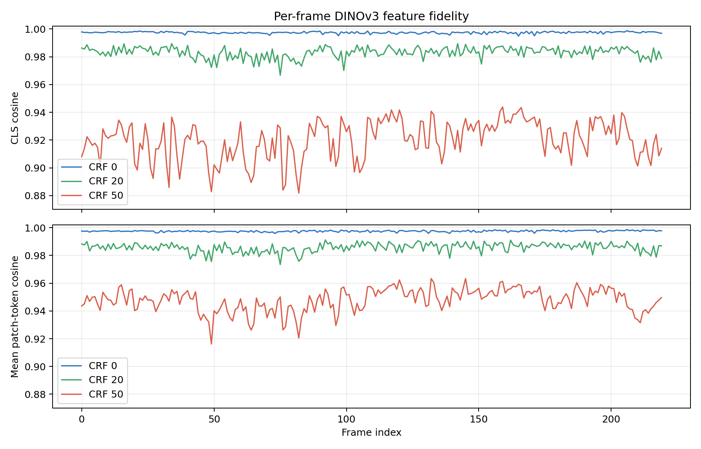

# HDF5 单帧与 LeRobot AV1 视频存储对比报告

生成时间：2026-07-28T11:51:59+08:00

## 结论摘要

本测试只比较头部相机 `observations/images/top` 的 220 帧 RGB 图像（640×480，30 FPS），不是整个 HDF5 文件。原始头部相机数组实际占用 193.36 MiB。

| 指标 | 原始 HDF5 单帧 | AV1 CRF 0 | AV1 CRF 20 | AV1 CRF 50 |
|---|---:|---:|---:|---:|
| 存储大小 | 193.36 MiB | 29.24 MiB | 3.71 MiB | 0.91 MiB |
| 占原始头部相机比例 | 100% | 15.12% | 1.92% | 0.47% |
| 空间节省 | 0% | 84.88% | 98.08% | 99.53% |
| 平均 MSE（0–255） | 0 | 2.4793 | 7.1022 | 18.1405 |
| 平均 MAE（0–255） | 0 | 1.2126 | 1.9541 | 2.8406 |
| 平均 PSNR | ∞ | 44.219 dB | 39.772 dB | 35.556 dB |
| 平均 SSIM | 1 | 0.988899 | 0.969800 | 0.948597 |
| DINOv3 CLS 余弦相似度 | 1 | 0.997426 | 0.983043 | 0.920263 |
| DINOv3 平均 patch-token 余弦相似度 | 1 | 0.997467 | 0.985670 | 0.947768 |

CRF 0 将头部相机存储降到原始的 15.12%，同时保持较高的像素和 DINOv3 特征一致性。CRF 20 将原始数据压缩约 52.2 倍，平均 CLS cosine 仍为 0.983043，是本测试中更实用的质量/容量折中。CRF 50 的文件又比 CRF 0 小 32.0 倍，但 DINOv3 CLS 余弦距离 `1-cos` 放大到约 31.0 倍，逐 patch 的余弦距离放大到约 20.6 倍。

因此：

- 若数据用于 DINO/视觉表征训练或离线特征提取，CRF 0 明显更稳妥。
- CRF 20 在本片段上保留了较高的 DINOv3 特征一致性，同时显著降低存储，是优先建议进一步做策略成功率 A/B 测试的档位。
- CRF 50 适合极端节省空间、人工浏览或低保真预览；不建议未经下游任务 A/B 验证就作为训练主数据。
- “视觉上仍清晰”不能替代特征评估：CRF 50 的平均 SSIM 仍为 0.9486，但 CLS 相似度已降至 0.9203。


## 测试设置

- HDF5：`/home/kewei/NAS/自采数据集/gift/分段数据/segmentation_C4_rechunked/rosbag2_2026_07_22-09_46_42__The_right_gripper_picks_and_places_the_toy_into_the_open_box..hdf5`
- 相机键：`observations/images/top`；HDF5 中为 RGB 顺序、`uint8`、无压缩、chunk 为 `[1, 480, 640, 3]`
- 视频：MP4 容器，`libsvtav1`，`yuv420p`，GOP=2，30 FPS，fast-decode=0
- 质量档：CRF 0、CRF 20 与 CRF 50
- LeRobot 当前 RGB 默认值是 AV1 / yuv420p / GOP 2 / CRF 30 / preset 12；本实验仅将 CRF 改成 0、20、50 三档。[LeRobot 编码参数文档](https://huggingface.co/docs/lerobot/main/video_encoding_parameters)
- 当前 SVT-AV1 3.1.2 把请求的 preset 12 映射为实际 preset 10；三档均发生相同映射，因此质量对比仍受控。
- 当前 FFmpeg `libsvtav1` wrapper 只有 `crf > 0` 才向 SVT 写入 CRF，直接传 `crf=0` 会静默回落到默认 35。本测试对 CRF 0 使用 `svtav1-params=crf=0` 直传，并由 SVT 日志确认实际 `CRF / 0`。[FFmpeg wrapper 源码](https://www.ffmpeg.org/doxygen/trunk/libsvtav1_8c_source.html)

CRF 0 不代表最终 RGB 像素完全无损：`yuv420p` 会进行 RGB↔YUV 转换和 4:2:0 色度下采样，所以仍存在像素差异。这里的“最低损失”指指定 LeRobot AV1/yuv420p 方案下的最低 CRF。

## 逐帧像素结果

| 档位 | PSNR 均值 / 最低 | SSIM 均值 / 最低 | MAE 均值 | 95% 像素通道绝对误差 | 最大绝对误差 |
|---|---:|---:|---:|---:|---:|
| CRF 0 | 44.219 / 43.554 dB | 0.988899 / 0.984861 | 1.213 | 3.00 | 24 |
| CRF 20 | 39.772 / 38.125 dB | 0.969800 / 0.962485 | 1.954 | 5.30 | 85 |
| CRF 50 | 35.556 / 34.730 dB | 0.948597 / 0.942993 | 2.841 | 8.49 | 140 |


CRF 0 的最差 SSIM 帧为 167，CRF 20 为 215，CRF 50 为 151。可视化文件：

- [CRF 0 最差像素帧](figures/worst_pixel_frame_crf0_min_loss.png)
- [CRF 20 最差像素帧](figures/worst_pixel_frame_crf20_balanced.png)
- [CRF 50 最差像素帧](figures/worst_pixel_frame_crf50_max_loss.png)

## DINOv3 特征影响

模型为 `dinov3_vits16`，权重维度 384。预处理严格采用仓库的分类评估流程：短边缩放至 256、中心裁剪 224×224、bicubic、ImageNet mean/std；因此 DINO 指标对应中心裁剪区域，而像素指标对应完整 640×480 图像。

| 指标 | CRF 0 | CRF 20 | CRF 50 |
|---|---:|---:|---:|
| CLS cosine（均值 / 最低） | 0.997426 / 0.994875 | 0.983043 / 0.966641 | 0.920263 / 0.881764 |
| CLS 夹角均值 | 4.077° | 10.498° | 22.957° |
| CLS relative L2 均值 | 0.0712 | 0.1823 | 0.3933 |
| mean-patch cosine 均值 | 0.998864 | 0.992548 | 0.970618 |
| patch-token cosine 均值 | 0.997467 | 0.985670 | 0.947768 |
| 单 patch 最低 cosine（全帧最差） | 0.926524 | 0.846235 | 0.747527 |



最差 CLS 帧：CRF 0 为 165，CRF 20 为 75，CRF 50 为 82。

- [CRF 0 最差 DINOv3 CLS 帧](figures/worst_dinov3_cls_frame_crf0_min_loss.png)
- [CRF 20 最差 DINOv3 CLS 帧](figures/worst_dinov3_cls_frame_crf20_balanced.png)
- [CRF 50 最差 DINOv3 CLS 帧](figures/worst_dinov3_cls_frame_crf50_max_loss.png)

## 像素指标与 DINO 指标相关性

| 档位 | SSIM vs CLS cosine | PSNR vs CLS cosine | SSIM vs patch cosine |
|---|---:|---:|---:|
| CRF 0 | 0.389 | 0.359 | 0.353 |
| CRF 20 | 0.396 | 0.473 | 0.414 |
| CRF 50 | 0.082 | 0.256 | 0.107 |

相关性只描述本段 220 帧内的共变关系，不能外推为通用因果关系。完整数值保存在 `results/cross_metric_correlations.json`。

## 方法与可复现性

1. 从 HDF5 按顺序读取原始 RGB 帧。
2. 使用与 LeRobot 相同的 PyAV 编码路径写入 AV1 MP4。
3. 顺序解码并严格验证三档视频均为 220 帧、640×480、30 FPS，逐帧一一对齐。
4. 在原始/解码帧上计算 MSE、RMSE、MAE、PSNR、SSIM、误差分位数、RGB 通道误差与偏置。
5. 对原始帧和三档解码帧使用同一 DINOv3 模型与预处理，比较 CLS、mean-patch 及 196 个位置对应 patch token。

LeRobot 的原始视频基准同样使用 MSE、PSNR、SSIM，并明确指出视频感知质量未必等价于神经网络输入质量。[LeRobot 视频编码研究](https://huggingface.co/blog/video-encoding)

运行：

```bash
cd /home/kewei/YING/robot_data_platform/test_lerobot
./run_all.sh --force
```

主要机器可读结果：

- `results/per_frame_pixel_metrics.csv`
- `results/pixel_summary.json`
- `results/per_frame_dinov3_metrics.csv`
- `results/dinov3_summary.json`
- `results/dinov3_global_embeddings.npz`
- `results/cross_metric_correlations.json`

## 局限

- 只有一个 7.33 秒片段和一个固定头部相机；对其他场景、运动速度、纹理和光照不能直接外推。
- 本测试衡量 DINOv3 表征漂移，没有训练并评估具体机器人策略；最终 CRF 仍应通过策略成功率 A/B 测试确定。
- 没有测试 LeRobot 默认 CRF 30；CRF 20 是新增的中间档，但最终最优值仍需更多片段和策略成功率验证。
- 编码/解码速度来自单次运行，且像素评估时间包含 Python 指标计算，不应视为纯解码吞吐基准。
