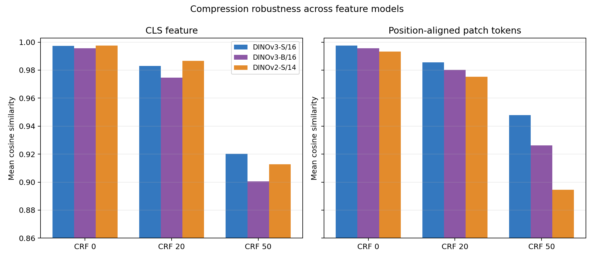
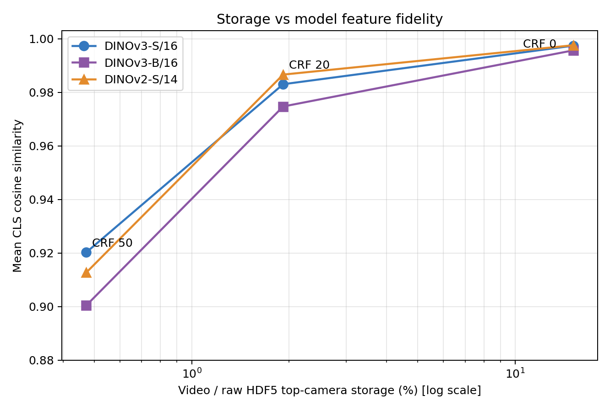
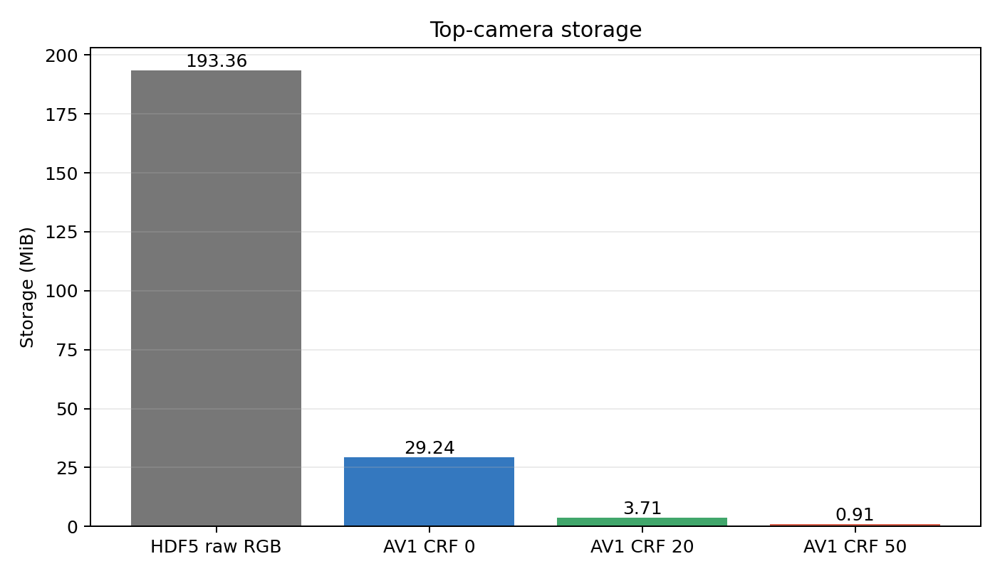
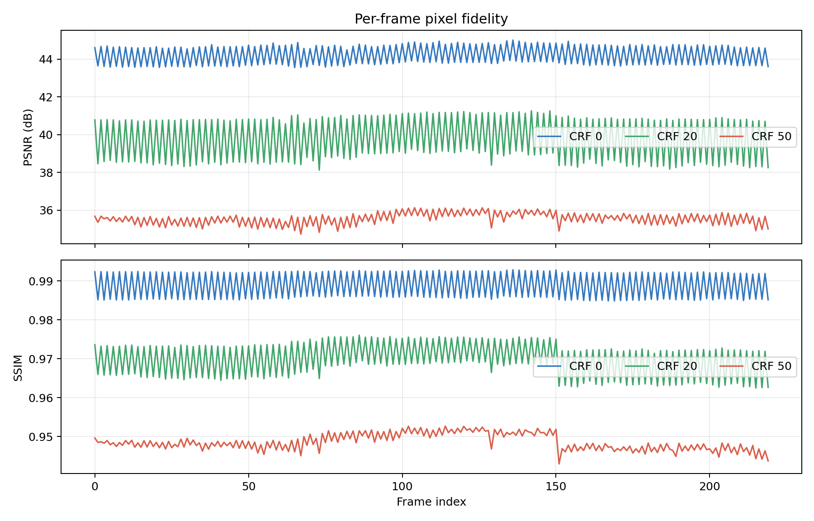
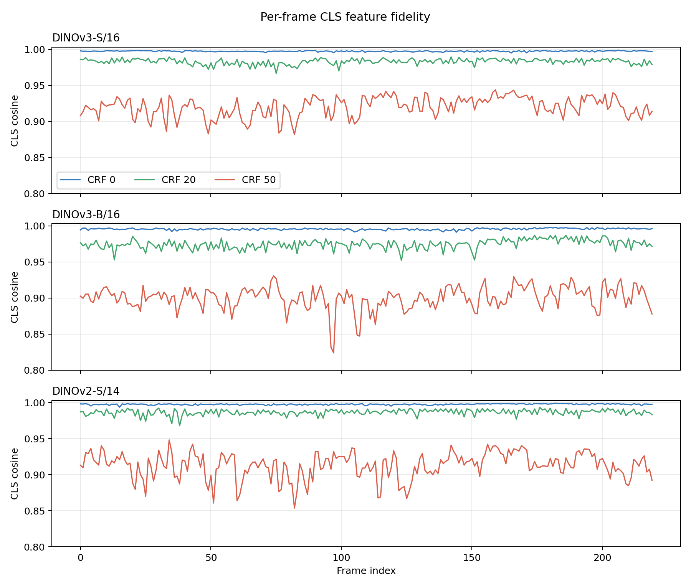
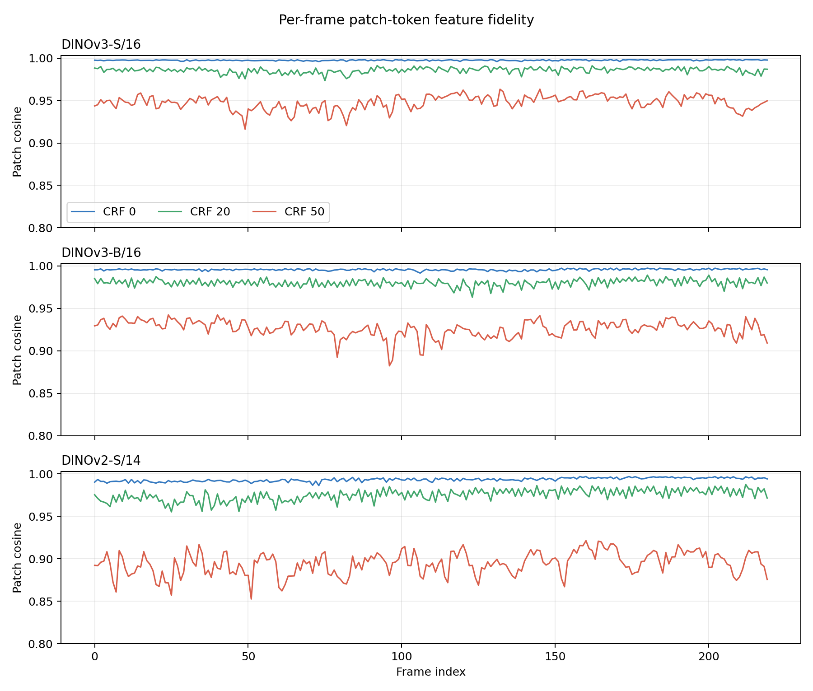

# HDF5 单帧、LeRobot AV1 与 DINO 特征横向对比报告

生成时间：2026-07-28T14:58:40+08:00

## 结论摘要

本测试比较头部相机 `observations/images/top` 的 220 帧 RGB 图像（640×480，30 FPS）。视频采用 LeRobot AV1 设置，测试 CRF 0、20、50；特征模型横向比较 DINOv3 ViT-S/16、DINOv3 ViT-B/16 和 DINOv2 ViT-S/14。

CRF 20 将头部相机数据从 193.36 MiB 压到 3.71 MiB（约缩小 52.2 倍），但三个模型的响应不同：

- CLS 保真度：DINOv2-S/14 最高（0.986634），其次 DINOv3-S/16（0.983043），DINOv3-B/16 最低（0.974732）。
- 位置对应 patch-token 保真度：DINOv3-S/16 最高（0.985670），DINOv3-B/16 为 0.980248，DINOv2-S/14 为 0.975207。
- CRF 50 下三者均明显退化；DINOv3-B/16 的 CLS 最敏感（0.900451），DINOv2-S/14 的局部 patch 最敏感（0.894531），DINOv3-S/16 整体最稳（CLS 0.920263、patch 0.947768）。

因此不存在对所有模型都相同的“安全 CRF”。CRF 20 仍是容量/特征质量较合理的候选，但上线前应使用实际下游模型和策略成功率验证；CRF 50 不建议作为训练主数据。





## 存储与像素结果

| 指标 | 原始 HDF5 单帧 | AV1 CRF 0 | AV1 CRF 20 | AV1 CRF 50 |
|---|---:|---:|---:|---:|
| 存储大小 | 193.36 MiB | 29.24 MiB | 3.71 MiB | 0.91 MiB |
| 占原始头部相机比例 | 100% | 15.12% | 1.92% | 0.47% |
| 空间节省 | 0% | 84.88% | 98.08% | 99.53% |
| 平均 PSNR | ∞ | 44.219 dB | 39.772 dB | 35.556 dB |
| 平均 SSIM | 1 | 0.988899 | 0.969800 | 0.948597 |
| 平均 MAE（0–255） | 0 | 1.2126 | 1.9541 | 2.8406 |





## 特征模型设置

三模型采用同一个确定性预处理：RGB、短边缩放 256、中心裁剪 224×224、bicubic、ImageNet mean/std。

| 模型 | 参数量 | 特征维度 | Patch size | Patch 网格 | Token 数 |
|---|---:|---:|---:|---:|---:|
| DINOv3 ViT-S/16 | 21.6M | 384 | 16 | 14×14 | 196 |
| DINOv3 ViT-B/16 | 85.7M | 768 | 16 | 14×14 | 196 |
| DINOv2 ViT-S/14 | 22.1M | 384 | 14 | 16×16 | 256 |

DINOv2 的 patch size 为 14，因此产生 16×16=256 个 token；DINOv3 的 patch size 为 16，产生 14×14=196 个 token。patch 指标只在各模型内部对同一空间位置的原始/压缩特征做比较，不跨模型直接匹配 token。

权重均从本地以 `strict=True` 加载：

- DINOv3 ViT-S/16：`/home/kewei/YING/dinov3/dino_ckpt/dinov3_vits16_pretrain_lvd1689m-08c60483.pth`
- DINOv3 ViT-B/16：`/home/kewei/YING/dinov3/dino_ckpt/dinov3_vitb16_pretrain_lvd1689m-73cec8be.pth`
- DINOv2 ViT-S/14：`/home/kewei/.cache/torch/hub/checkpoints/dinov2_vits14_pretrain.pth`

## 三模型 × 三压缩档结果

| 模型 | 视频档位 | CLS cosine 均值 / 最低 | Patch cosine 均值 | CLS relative L2 | CLS 夹角均值 |
|---|---|---:|---:|---:|---:|
| DINOv3-S/16 | CRF 0 | 0.997426 / 0.994875 | 0.997467 | 0.0712 | 4.077° |
| DINOv3-S/16 | CRF 20 | 0.983043 / 0.966641 | 0.985670 | 0.1823 | 10.498° |
| DINOv3-S/16 | CRF 50 | 0.920263 / 0.881764 | 0.947768 | 0.3933 | 22.957° |
| DINOv3-B/16 | CRF 0 | 0.995676 / 0.991251 | 0.995676 | 0.0921 | 5.278° |
| DINOv3-B/16 | CRF 20 | 0.974732 / 0.951844 | 0.980248 | 0.2218 | 12.800° |
| DINOv3-B/16 | CRF 50 | 0.900451 / 0.823888 | 0.926222 | 0.4389 | 25.711° |
| DINOv2-S/14 | CRF 0 | 0.997595 / 0.993546 | 0.993291 | 0.0684 | 3.918° |
| DINOv2-S/14 | CRF 20 | 0.986634 / 0.967815 | 0.975207 | 0.1622 | 9.279° |
| DINOv2-S/14 | CRF 50 | 0.912731 / 0.853624 | 0.894531 | 0.4164 | 23.998° |





## 最差 CLS 帧

各模型、各压缩档的原始帧/解码帧/放大差异图：


- DINOv3-S/16：[CRF 0（帧 165）](figures/worst_cls_dinov3_vits16_crf0_min_loss.png)、[CRF 20（帧 75）](figures/worst_cls_dinov3_vits16_crf20_balanced.png)、[CRF 50（帧 82）](figures/worst_cls_dinov3_vits16_crf50_max_loss.png)
- DINOv3-B/16：[CRF 0（帧 144）](figures/worst_cls_dinov3_vitb16_crf0_min_loss.png)、[CRF 20（帧 123）](figures/worst_cls_dinov3_vitb16_crf20_balanced.png)、[CRF 50（帧 97）](figures/worst_cls_dinov3_vitb16_crf50_max_loss.png)
- DINOv2-S/14：[CRF 0（帧 15）](figures/worst_cls_dinov2_vits14_crf0_min_loss.png)、[CRF 20（帧 38）](figures/worst_cls_dinov2_vits14_crf20_balanced.png)、[CRF 50（帧 82）](figures/worst_cls_dinov2_vits14_crf50_max_loss.png)

## DINO patch 特征图

完整逐帧 patch-token 张量已经按模型分别保存。每个 NPZ 都包含 `original`、`crf0_min_loss`、`crf20_balanced`、`crf50_max_loss` 四个键，dtype 为 float16：

| 模型 | 每个键的形状 `[帧, token, 维度]` | NPZ 大小 | 文件 |
|---|---:|---:|---|
| DINOv3-S/16 | `[220, 196, 384]` | 117.1 MiB | [下载/打开](results/feature_maps/dinov3_vits16_patch_tokens_float16.npz) |
| DINOv3-B/16 | `[220, 196, 768]` | 233.5 MiB | [下载/打开](results/feature_maps/dinov3_vitb16_patch_tokens_float16.npz) |
| DINOv2-S/14 | `[220, 256, 384]` | 152.4 MiB | [下载/打开](results/feature_maps/dinov2_vits14_patch_tokens_float16.npz) |

PCA-RGB 可视化对同一模型、同一帧的原始/三档压缩特征使用共享 PCA 基底及共享颜色范围，因此同一张图内颜色可直接比较。不同模型或不同帧的 PCA 基底不同，不应按绝对颜色跨图比较。

- [DINOv3-S/16 第 110 帧特征图](figures/feature_maps/dinov3_vits16/frame_0110_pca.png)
- [DINOv3-B/16 第 110 帧特征图](figures/feature_maps/dinov3_vitb16/frame_0110_pca.png)
- [DINOv2-S/14 第 110 帧特征图](figures/feature_maps/dinov2_vits14/frame_0110_pca.png)

读取示例：

```python
import numpy as np

data = np.load("results/feature_maps/dinov3_vits16_patch_tokens_float16.npz")
tokens = data["crf20_balanced"]        # [220, 196, 384]
feature_maps = tokens.reshape(220, 14, 14, 384)
```

## 编码设置与实现说明

- HDF5：`/home/kewei/NAS/自采数据集/gift/分段数据/segmentation_C4_rechunked/rosbag2_2026_07_22-09_46_42__The_right_gripper_picks_and_places_the_toy_into_the_open_box..hdf5`
- 相机键：`observations/images/top`；`uint8` RGB，无 HDF5 压缩
- MP4：`libsvtav1`、`yuv420p`、GOP=2、30 FPS、fast-decode=0
- LeRobot 当前 RGB 默认值是 AV1 / yuv420p / GOP 2 / CRF 30 / preset 12；本实验将 CRF 改成 0、20、50。[LeRobot 编码参数文档](https://huggingface.co/docs/lerobot/main/video_encoding_parameters)
- 当前 SVT-AV1 3.1.2 把请求 preset 12 映射为实际 preset 10，三档一致。
- FFmpeg wrapper 会把直接传入的 CRF 0 当作未设置；代码使用 `svtav1-params=crf=0` 直传并由 SVT 日志确认。[FFmpeg wrapper 源码](https://www.ffmpeg.org/doxygen/trunk/libsvtav1_8c_source.html)
- CRF 0 仍不是 RGB 逐像素无损，因为 `yuv420p` 包含 RGB↔YUV 转换和 4:2:0 色度下采样。

## 可复现性与输出

```bash
cd /home/kewei/YING/robot_data_platform/test_lerobot
./run_all.sh --force
```

主要结果：

- `results/per_frame_pixel_metrics.csv`：3×220 条逐帧像素指标
- `results/pixel_summary.json`：像素和存储汇总
- `results/per_frame_model_feature_metrics.csv`：3 模型×3 压缩档×220 帧，共 1980 条特征指标
- `results/model_feature_summary.json`：多模型汇总
- `results/model_global_embeddings.npz`：各模型原始与解码全局特征
- `results/feature_maps/*.npz`：完整逐帧 patch-token 特征图
- `figures/feature_maps/<model>/`：共享 PCA 基底的特征图可视化
- `results/cross_metric_correlations.json`：逐模型的像素/特征相关性

## 局限

- 只有一个 7.33 秒片段和一个头部相机，不能直接外推到其他场景。
- 不同模型的特征空间和归一化统计不同；横向 cosine 数值用于比较各模型受同一压缩扰动的相对漂移，不代表模型能力高低。
- 本测试没有训练具体机器人策略，最终 CRF 应用策略成功率 A/B 测试确定。
- DINOv2 和 DINOv3 的 patch 网格不同，因此只比较各自位置对齐 token 的平均稳定性。
