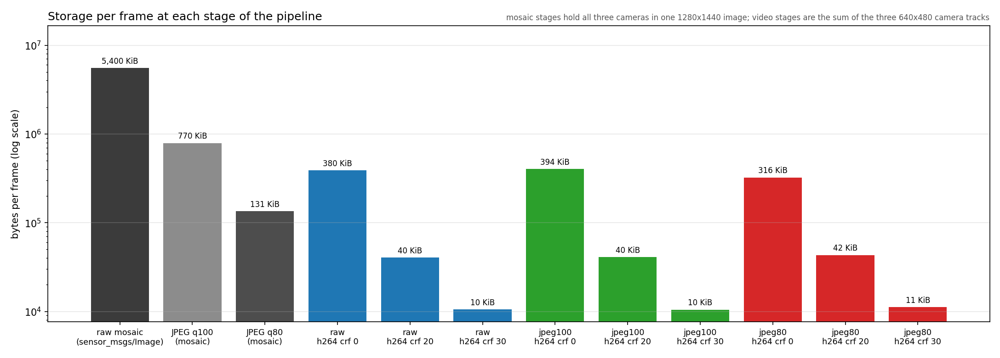
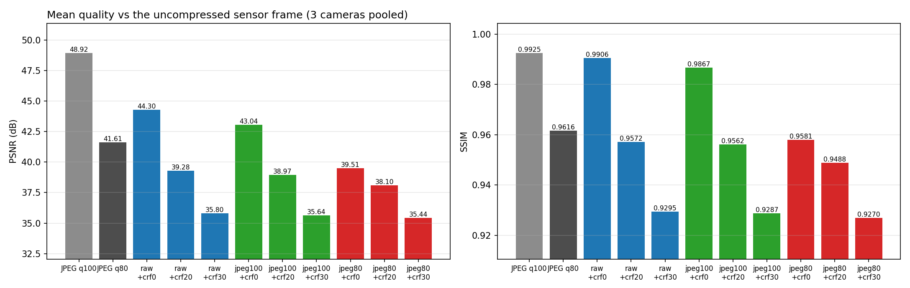
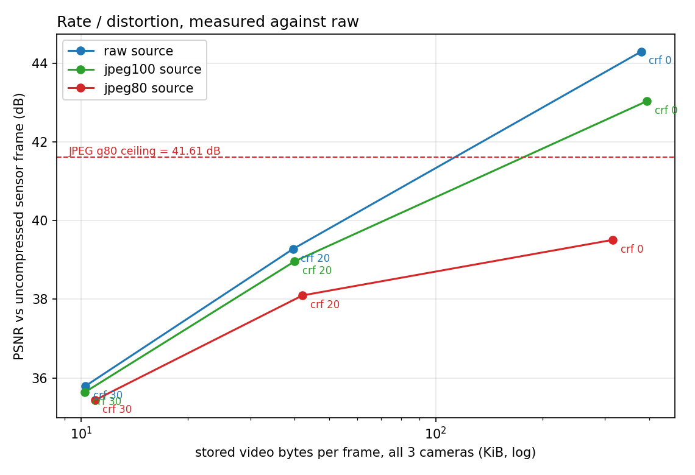
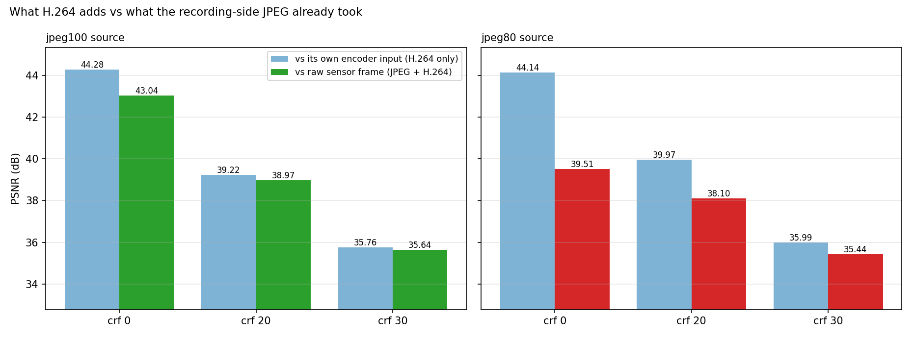
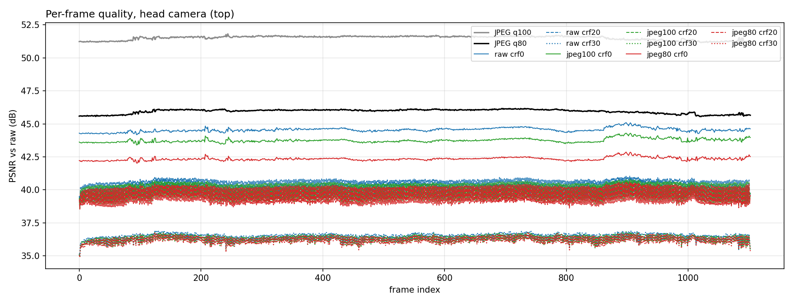
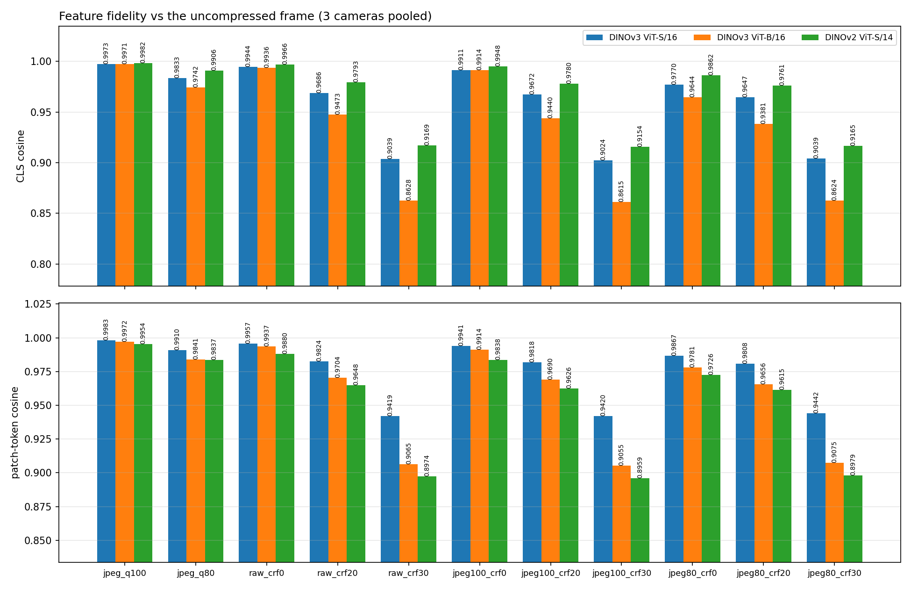
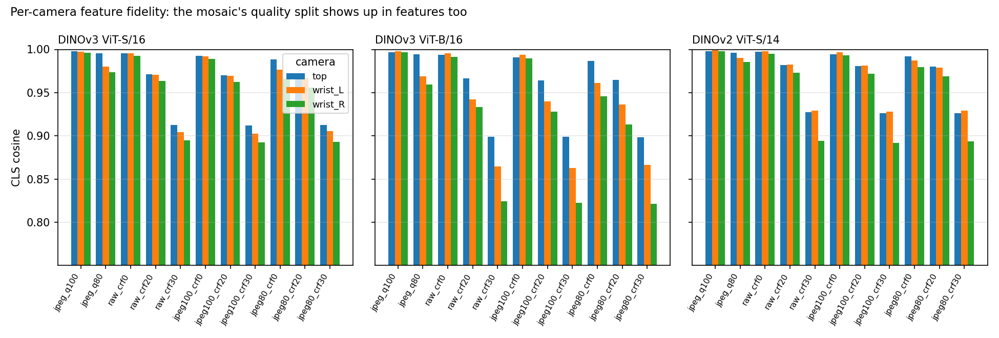
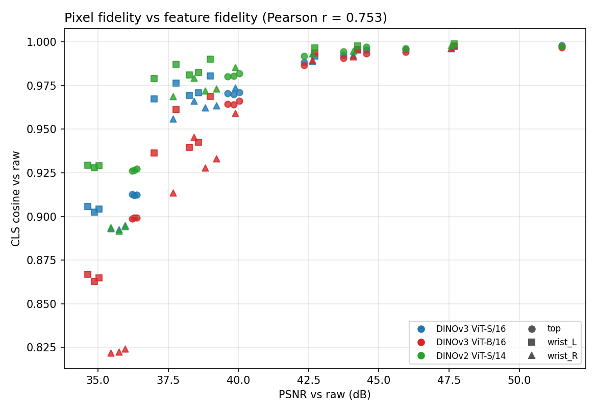

# 原始图像 vs JPEG 压缩图像：录制端与 LeRobot 存储端的画质影响测试

生成时间：2026-08-05T02:56:05-04:00

## 结论摘要

本测试使用 `express_raw` 中唯一一段未压缩录制（`/quad_tile`，`sensor_msgs/Image`，1280×1440 马赛克，1103 个对齐控制行，36.77 s）作为像素级基准，逐级比较录制端 JPEG 与 LeRobot 视频编码带来的损失。所有 PSNR/SSIM 均以未压缩原始帧为参照，三相机取平均（逐相机数值见后文表格）。

1. **q80 的损失几乎全部压在两路 wrist 相机上。** 三相机平均 PSNR 41.611 dB / SSIM 0.961638，但拆开来 head 45.952 dB、wrist_L 38.994 dB、wrist_R 39.885 dB，相差 6–7 dB。原因是 hero3 马赛克把 head 以 2× 放大存放（占了 4 倍面积），JPEG 作用在放大后的像素上，切分时的下采样又把噪声平均掉；两路 wrist 是原生分辨率，误差原样保留。做精细操作的恰恰是 wrist。

2. **如果最终按 CRF 20/30 存储，录制端 JPEG 的额外代价很小。** 同一 CRF 下 jpeg80 源相对 raw 源只低 1.181 dB（CRF 20）和 0.359 dB（CRF 30）——视频编码自身的损失已经盖过 JPEG。只有在接近无损存储时 JPEG 才是主导项：CRF 0 下两者相差 4.785 dB。

3. **q100 说明「要不要压」和「压到多少」是两个问题。** 第三条链路 jpeg100 源相对 raw 源，在 CRF 20/30 上只低 0.314 / 0.159 dB，而录制端体积只有原始的 1/7.0——录制端压缩本身近乎免费。但在 CRF 0 上它低 1.260 dB **而且**比 raw 源还大 3.7%（424.07 vs 408.82 MiB），是严格劣势的一格：JPEG 的轻微振铃既没被 CRF 0 丢掉，又得花码率去编码。

4. **反过来说，源是 q80 时用 CRF 0 是纯浪费。** jpeg80→CRF 0 为 39.511 dB / 339.86 MiB，raw→CRF 20 为 39.280 dB / 42.66 MiB：画质基本相同，体积差 8.0 倍。低 CRF 只是在高保真地保存 JPEG 块噪声。

5. **预压缩还会让同 CRF 的文件变大。** q80 源 vs raw 源：CRF 20 45.35 vs 42.66 MiB（+6.3%），CRF 30 11.79 vs 11.08 MiB（+6.4%）。JPEG 的块状噪声是高频信号，H.264 得额外花码率去编码它。q80 只在 CRF 0 上例外（−16.9%），因为那时它抹掉的细节确实不用再编码——而 q100 没抹掉多少细节，所以连这一格都是净增（见第 3 条）。

6. **DINO 特征给出同样的结论。** 三个主干上，jpeg80 源相对 raw 源的 CLS cosine 损失：CRF 20 为 0.0031–0.0092，CRF 30 为 -0.0001–0.0004（已在噪声量级），而 CRF 0 为 0.0105–0.0291。像素上看到的「低 CRF 才暴露 JPEG」在特征上原样成立。PSNR 与 CLS cosine 之间 Spearman ρ = 0.927 但 Pearson r = 0.753——排序一致、数值不成比例，所以 PSNR 可以用来排序档位，不能用来当验收阈值（见阶段三）。

### 建议

- 训练集按 CRF 20 存储时（本段 43.1 MiB / 36.8 s），继续用 q80 录制是合理的，代价约 1.2 dB。
- 要提升 wrist 画质，应该改录制端而不是降 CRF：提高 `publish.jpeg_quality`，或调整 `mosaic.top_height` 让马赛克不再把 4 倍面积分给 head，或改录 `per_camera_compressed` 的原生话题。在 q80 源上降 CRF 的收益按第 2、3 条递减。
- 不要在 q80 源上使用 CRF 0：更大、更慢，画质并不比 raw→CRF 20 好。
- 用 PSNR 排序候选档位没问题，但验收线要落在特征指标上：两者单调一致而不成比例，同样 3 dB 在高保真区几乎不改变特征、在低保真区能改变 0.05 以上的 CLS cosine。





## 实验设计

`express_mcap` 与 `express_raw` 是两次不同的录制，帧内容不同，无法逐像素比较。因此本测试不直接对比这两个包，而是构造缺失的对照组：把 `express_raw` 分别按 q100 与 q80 重新编码成 JPEG 的 mcap（时间戳、关节数据逐字节复制，只替换图像话题），使三条链路面对**完全相同的帧**。q80 是生产配置，q100 用来把「压了」和「压狠了」这两件事分开。`express_mcap` 只用于验证合成的 q80 码率是否与真实录制一致。

```
                 ┌─ (A) 直接转换 ─────────────────► LeRobot h264 CRF 0/20/30
raw /quad_tile ──┼─ JPEG q100 (cv2, 马赛克整幅) ──► LeRobot h264 CRF 0/20/30   (B)
  (基准帧)        └─ JPEG q80  (cv2, 马赛克整幅) ──► LeRobot h264 CRF 0/20/30   (C) 生产链路
```

| 环节 | 设置 | 依据 |
|---|---|---|
| 录制端 JPEG | `cv2.imencode('.jpg', BGR马赛克, [IMWRITE_JPEG_QUALITY, q])`，q ∈ {100, 80}，4:2:0 | `Apex_Deploy_new/components/realsense/src/realsense_node.cpp:333` |
| 视频编码 | h264 / yuv420p / GOP 2 / preset 默认 / CRF ∈ {0, 20, 30} | `tool/lerobot_v3_common.py:RGBVideoConfig` |
| 对齐 | `lerobot-loop`，`anchor-camera-ticks`，`--state-tolerance-ms 20` | 与生产转换命令一致 |
| 相机切分 | hero3 马赛克 → top(1280×960→640×480) / wrist_L / wrist_R(640×480 原生) | `tool/profiles/marvin-gripper-quadtile.json` |

关键一致性检查：第二遍解码出的马赛克按 profile 裁剪后，与转换器实际写入的 tile 逐字节相等（1103 帧 × 3 相机全部通过），因此三条链路确实对齐在同一批帧上。

## 阶段一：录制端 JPEG 相对原始帧

### 马赛克整幅（JPEG 实际作用的对象）

| 指标 | 原始 | JPEG q100 | JPEG q80 |
|---|---:|---:|---:|
| 每帧字节 | 5,529,600 | 788,415 | 134,638 |
| 每帧字节（KiB） | 5,400 | 769.9 | 131.5 |
| 压缩比 | 1.0× | 7.0× | 41.1× |
| 30 FPS 码率 | 1327.1 Mb/s | 189.2 Mb/s | 32.3 Mb/s |
| PSNR | ∞ | 49.478 dB | 42.296 dB |
| SSIM | 1 | 0.993819 | 0.974671 |
| MAE (0–255) | 0 | 0.5170 | 1.2808 |
| 最大绝对误差 | 0 | 33 | 56 |
| 色度采样 | — | 4:2:0 | 4:2:0 |

### 切分后的三路相机（LeRobot 实际存储的画面）

| 相机 | q100 PSNR | q100 SSIM | q100 MAE | q80 PSNR | q80 SSIM | q80 MAE |
|---|---:|---:|---:|---:|---:|---:|
| top | 51.518 dB | 0.996131 | 0.4026 | 45.952 dB | 0.987620 | 0.9055 |
| wrist_L | 47.680 dB | 0.990802 | 0.6663 | 38.994 dB | 0.943333 | 2.0175 |
| wrist_R | 47.572 dB | 0.990609 | 0.6502 | 39.885 dB | 0.953962 | 1.7804 |

`top` 与两路 wrist 的差异来自马赛克布局：head 在马赛克里是 2× 放大存放的，JPEG 作用在放大后的像素上，切分时再缩回 640×480，这一次下采样会平均掉一部分 JPEG 噪声；wrist 是原生分辨率，JPEG 误差被原样保留。

### 与真实生产录制的码率对照

`express_mcap` 采样 12 个包、14,631 帧，`/quad_tile/compressed` 平均 132.1 KiB/帧（中位 130.7，p05–p95 118.3–148.7），4:2:0，1280x1440。本测试合成的 q80 平均 131.5 KiB/帧，两者相差 0.4%，说明合成链路与真实录制端的编码参数一致（差异来自两次录制的画面内容不同）。

## 阶段二：LeRobot 视频编码

以下九个数据集全部由 `tool/rosbag2_to_lerobotv3.py` 真实产出，每个 1103 帧 × 3 相机，因此表中的体积就是训练集的实际体积。

| 源 | CRF | 数据集总体积 | 三路视频合计 | 每帧字节 | 码率 | PSNR vs 原始 | SSIM vs 原始 |
|---|---:|---:|---:|---:|---:|---:|---:|
| raw | 0 | 409.22 MiB | 408.82 MiB | 379.5 KiB | 93.28 Mb/s | 44.296 dB | 0.990563 |
| raw | 20 | 43.05 MiB | 42.66 MiB | 39.6 KiB | 9.73 Mb/s | 39.280 dB | 0.957208 |
| raw | 30 | 11.48 MiB | 11.08 MiB | 10.3 KiB | 2.53 Mb/s | 35.796 dB | 0.929478 |
| jpeg100 | 0 | 424.46 MiB | 424.07 MiB | 393.7 KiB | 96.75 Mb/s | 43.037 dB | 0.986688 |
| jpeg100 | 20 | 43.50 MiB | 43.11 MiB | 40.0 KiB | 9.84 Mb/s | 38.966 dB | 0.956236 |
| jpeg100 | 30 | 11.43 MiB | 11.03 MiB | 10.2 KiB | 2.52 Mb/s | 35.638 dB | 0.928705 |
| jpeg80 | 0 | 340.26 MiB | 339.86 MiB | 315.5 KiB | 77.54 Mb/s | 39.511 dB | 0.958058 |
| jpeg80 | 20 | 45.75 MiB | 45.35 MiB | 42.1 KiB | 10.35 Mb/s | 38.099 dB | 0.948808 |
| jpeg80 | 30 | 12.19 MiB | 11.79 MiB | 10.9 KiB | 2.69 Mb/s | 35.438 dB | 0.926954 |



### 逐相机明细

| 源 | CRF | 相机 | 视频体积 | 码率 | PSNR vs 原始 | SSIM vs 原始 | PSNR vs 编码器输入 |
|---|---:|---|---:|---:|---:|---:|---:|
| raw | 0 | top | 111.56 MiB | 25.45 Mb/s | 44.551 dB | 0.992977 | — |
| raw | 0 | wrist_L | 156.01 MiB | 35.60 Mb/s | 44.250 dB | 0.989590 | — |
| raw | 0 | wrist_R | 141.24 MiB | 32.23 Mb/s | 44.088 dB | 0.989122 | — |
| raw | 20 | top | 11.17 MiB | 2.55 Mb/s | 40.040 dB | 0.974424 | — |
| raw | 20 | wrist_L | 17.50 MiB | 3.99 Mb/s | 38.586 dB | 0.944299 | — |
| raw | 20 | wrist_R | 13.99 MiB | 3.19 Mb/s | 39.214 dB | 0.952900 | — |
| raw | 30 | top | 3.60 MiB | 0.82 Mb/s | 36.384 dB | 0.959152 | — |
| raw | 30 | wrist_L | 3.93 MiB | 0.90 Mb/s | 35.036 dB | 0.903769 | — |
| raw | 30 | wrist_R | 3.55 MiB | 0.81 Mb/s | 35.970 dB | 0.925514 | — |
| jpeg100 | 0 | top | 116.39 MiB | 26.55 Mb/s | 43.747 dB | 0.990977 | 44.418 dB |
| jpeg100 | 0 | wrist_L | 160.47 MiB | 36.61 Mb/s | 42.729 dB | 0.984902 | 44.267 dB |
| jpeg100 | 0 | wrist_R | 147.21 MiB | 33.59 Mb/s | 42.633 dB | 0.984185 | 44.142 dB |
| jpeg100 | 20 | top | 11.34 MiB | 2.59 Mb/s | 39.828 dB | 0.974067 | 39.896 dB |
| jpeg100 | 20 | wrist_L | 17.71 MiB | 4.04 Mb/s | 38.255 dB | 0.943296 | 38.582 dB |
| jpeg100 | 20 | wrist_R | 14.06 MiB | 3.21 Mb/s | 38.814 dB | 0.951344 | 39.182 dB |
| jpeg100 | 30 | top | 3.61 MiB | 0.82 Mb/s | 36.287 dB | 0.958928 | 36.304 dB |
| jpeg100 | 30 | wrist_L | 3.91 MiB | 0.89 Mb/s | 34.878 dB | 0.903017 | 35.028 dB |
| jpeg100 | 30 | wrist_R | 3.51 MiB | 0.80 Mb/s | 35.748 dB | 0.924169 | 35.962 dB |
| jpeg80 | 0 | top | 105.75 MiB | 24.13 Mb/s | 42.350 dB | 0.984221 | 44.373 dB |
| jpeg80 | 0 | wrist_L | 125.97 MiB | 28.74 Mb/s | 37.774 dB | 0.939785 | 44.047 dB |
| jpeg80 | 0 | wrist_R | 108.14 MiB | 24.67 Mb/s | 38.410 dB | 0.950169 | 44.001 dB |
| jpeg80 | 20 | top | 12.00 MiB | 2.74 Mb/s | 39.623 dB | 0.972579 | 39.937 dB |
| jpeg80 | 20 | wrist_L | 18.12 MiB | 4.13 Mb/s | 37.000 dB | 0.930849 | 39.747 dB |
| jpeg80 | 20 | wrist_R | 15.23 MiB | 3.48 Mb/s | 37.674 dB | 0.942998 | 40.213 dB |
| jpeg80 | 30 | top | 3.63 MiB | 0.83 Mb/s | 36.217 dB | 0.958473 | 36.271 dB |
| jpeg80 | 30 | wrist_L | 4.31 MiB | 0.98 Mb/s | 34.640 dB | 0.900828 | 35.394 dB |
| jpeg80 | 30 | wrist_R | 3.85 MiB | 0.88 Mb/s | 35.457 dB | 0.921559 | 36.308 dB |

## 级联损失：JPEG 与 H.264 各自的份额

`vs 编码器输入` 只测量 H.264 在已压缩帧上又扣掉了多少，`vs 原始` 是端到端。两者的差就是录制端 JPEG 已经造成的、CRF 无论如何都追不回来的部分。



| CRF | raw 源 | JPEG q100 源 | JPEG q80 源 | q100 代价 | q80 代价 |
|---:|---:|---:|---:|---:|---:|
| 0 | 44.296 dB | 43.037 dB | 39.511 dB | −1.260 dB | −4.785 dB |
| 20 | 39.280 dB | 38.966 dB | 38.099 dB | −0.314 dB | −1.181 dB |
| 30 | 35.796 dB | 35.638 dB | 35.438 dB | −0.159 dB | −0.359 dB |

「代价」是相对同 CRF 的 raw 源。q100 那一列几乎为零，说明**录制端压缩本身不是问题，问题是压到 80**——尽管 q100 在录制端要多花 5.9 倍的字节。



### GOP=2 造成的逐帧画质振荡

上图里 CRF 20/30 的曲线是锯齿状的，CRF 0 与 JPEG 曲线则平滑。原因是 LeRobot 的 RGB 编码参数用 `g=2`：每两帧一个 I 帧，中间夹一个 P 帧，而在有损档位上 P 帧的重建质量明显低于 I 帧。head 相机上偶数帧（I）与奇数帧（P）的平均差：

| 源 | CRF | I 帧 | P 帧 | 差 |
|---|---:|---:|---:|---:|
| raw | 0 | 44.550 dB | 44.552 dB | -0.002 dB |
| raw | 20 | 40.742 dB | 39.338 dB | +1.404 dB |
| raw | 30 | 36.639 dB | 36.127 dB | +0.512 dB |
| jpeg80 | 0 | 42.349 dB | 42.350 dB | -0.001 dB |
| jpeg80 | 20 | 40.261 dB | 38.985 dB | +1.276 dB |
| jpeg80 | 30 | 36.465 dB | 35.968 dB | +0.497 dB |

偶数帧确实是 I 帧：直接读 `raw_crf20` 头部视频的 `pict_type`，552 个 I / 551 个 P，全部按下标奇偶交替，无例外。

CRF 0 下这一项为 0（±0.002 dB），CRF 20 下达到 1.3–1.4 dB。也就是说按 CRF 20 存的数据集里，相邻两帧的画质是系统性交替的——对逐帧独立的策略无所谓，但做时序建模或帧间差分时值得知道这一点。

### 最差帧（head 相机，按 SSIM）

- [raw + CRF 0](figures/worst_raw_crf0_top.png)
- [raw + CRF 20](figures/worst_raw_crf20_top.png)
- [raw + CRF 30](figures/worst_raw_crf30_top.png)
- [jpeg100 + CRF 0](figures/worst_jpeg100_crf0_top.png)
- [jpeg100 + CRF 20](figures/worst_jpeg100_crf20_top.png)
- [jpeg100 + CRF 30](figures/worst_jpeg100_crf30_top.png)
- [jpeg80 + CRF 0](figures/worst_jpeg80_crf0_top.png)
- [jpeg80 + CRF 20](figures/worst_jpeg80_crf20_top.png)
- [jpeg80 + CRF 30](figures/worst_jpeg80_crf30_top.png)

## 阶段三：DINO 特征漂移

像素指标回答「差多少」，但训练的是视觉主干，真正要问的是「特征差多少」。本节直接复用 `test_lerobot/scripts/dinov3_feature_eval.py` 的模型、预处理（RGB、短边 256、中心裁剪 224、bicubic、ImageNet mean/std）与指标定义，因此两份报告的 cosine 可以直接并排读。

| 模型 | Patch size | Patch 网格 | Token 数 | 权重 |
|---|---:|---:|---:|---|
| DINOv3 ViT-S/16 | 16 | 14×14 | 196 | `dinov3_vits16_pretrain_lvd1689m-08c60483.pth` |
| DINOv3 ViT-B/16 | 16 | 14×14 | 196 | `dinov3_vitb16_pretrain_lvd1689m-73cec8be.pth` |
| DINOv2 ViT-S/14 | 14 | 16×16 | 256 | `dinov2_vits14_pretrain.pth` |



### 三相机平均

| 模型 | 档位 | CLS cosine | Patch cosine | CLS relative L2 | CLS 夹角 |
|---|---|---:|---:|---:|---:|
| DINOv3 ViT-S/16 | jpeg_q100 | 0.997335 | 0.998316 | 0.0701 | 4.014° |
| DINOv3 ViT-S/16 | jpeg_q80 | 0.983347 | 0.991003 | 0.1692 | 9.717° |
| DINOv3 ViT-S/16 | raw_crf0 | 0.994446 | 0.995743 | 0.1018 | 5.836° |
| DINOv3 ViT-S/16 | raw_crf20 | 0.968561 | 0.982440 | 0.2474 | 14.212° |
| DINOv3 ViT-S/16 | raw_crf30 | 0.903858 | 0.941939 | 0.4360 | 25.151° |
| DINOv3 ViT-S/16 | jpeg100_crf0 | 0.991095 | 0.994096 | 0.1303 | 7.473° |
| DINOv3 ViT-S/16 | jpeg100_crf20 | 0.967202 | 0.981835 | 0.2530 | 14.531° |
| DINOv3 ViT-S/16 | jpeg100_crf30 | 0.902366 | 0.942018 | 0.4394 | 25.345° |
| DINOv3 ViT-S/16 | jpeg80_crf0 | 0.977041 | 0.986749 | 0.2060 | 11.827° |
| DINOv3 ViT-S/16 | jpeg80_crf20 | 0.964668 | 0.980837 | 0.2618 | 15.039° |
| DINOv3 ViT-S/16 | jpeg80_crf30 | 0.903933 | 0.944150 | 0.4359 | 25.140° |
| DINOv3 ViT-B/16 | jpeg_q100 | 0.997063 | 0.997232 | 0.0742 | 4.247° |
| DINOv3 ViT-B/16 | jpeg_q80 | 0.974164 | 0.984130 | 0.2074 | 11.993° |
| DINOv3 ViT-B/16 | raw_crf0 | 0.993576 | 0.993659 | 0.1100 | 6.306° |
| DINOv3 ViT-B/16 | raw_crf20 | 0.947344 | 0.970442 | 0.3139 | 18.259° |
| DINOv3 ViT-B/16 | raw_crf30 | 0.862798 | 0.906515 | 0.5071 | 29.844° |
| DINOv3 ViT-B/16 | jpeg100_crf0 | 0.991413 | 0.991379 | 0.1275 | 7.321° |
| DINOv3 ViT-B/16 | jpeg100_crf20 | 0.943968 | 0.969005 | 0.3235 | 18.829° |
| DINOv3 ViT-B/16 | jpeg100_crf30 | 0.861453 | 0.905454 | 0.5095 | 29.990° |
| DINOv3 ViT-B/16 | jpeg80_crf0 | 0.964448 | 0.978149 | 0.2500 | 14.498° |
| DINOv3 ViT-B/16 | jpeg80_crf20 | 0.938138 | 0.965572 | 0.3366 | 19.626° |
| DINOv3 ViT-B/16 | jpeg80_crf30 | 0.862418 | 0.907482 | 0.5076 | 29.885° |
| DINOv2 ViT-S/14 | jpeg_q100 | 0.998246 | 0.995411 | 0.0565 | 3.234° |
| DINOv2 ViT-S/14 | jpeg_q80 | 0.990648 | 0.983669 | 0.1301 | 7.454° |
| DINOv2 ViT-S/14 | raw_crf0 | 0.996606 | 0.988019 | 0.0781 | 4.474° |
| DINOv2 ViT-S/14 | raw_crf20 | 0.979267 | 0.964750 | 0.1996 | 11.450° |
| DINOv2 ViT-S/14 | raw_crf30 | 0.916929 | 0.897372 | 0.4018 | 23.178° |
| DINOv2 ViT-S/14 | jpeg100_crf0 | 0.994806 | 0.983773 | 0.0983 | 5.637° |
| DINOv2 ViT-S/14 | jpeg100_crf20 | 0.977966 | 0.962637 | 0.2063 | 11.836° |
| DINOv2 ViT-S/14 | jpeg100_crf30 | 0.915446 | 0.895947 | 0.4052 | 23.382° |
| DINOv2 ViT-S/14 | jpeg80_crf0 | 0.986155 | 0.972641 | 0.1607 | 9.221° |
| DINOv2 ViT-S/14 | jpeg80_crf20 | 0.976127 | 0.961544 | 0.2143 | 12.304° |
| DINOv2 ViT-S/14 | jpeg80_crf30 | 0.916492 | 0.897948 | 0.4027 | 23.235° |

### 逐相机：像素上的头/腕差距在特征上同样存在



| 模型 | 档位 | top | wrist_L | wrist_R | 头腕差 |
|---|---|---:|---:|---:|---:|
| DINOv3 ViT-S/16 | jpeg_q80 | 0.995845 | 0.980418 | 0.973778 | +0.018747 |
| DINOv3 ViT-S/16 | raw_crf20 | 0.971303 | 0.970768 | 0.963613 | +0.004112 |
| DINOv3 ViT-S/16 | jpeg80_crf20 | 0.970654 | 0.967361 | 0.955988 | +0.008980 |
| DINOv3 ViT-B/16 | jpeg_q80 | 0.994329 | 0.968874 | 0.959289 | +0.030247 |
| DINOv3 ViT-B/16 | raw_crf20 | 0.966298 | 0.942473 | 0.933261 | +0.028431 |
| DINOv3 ViT-B/16 | jpeg80_crf20 | 0.964503 | 0.936408 | 0.913503 | +0.039548 |
| DINOv2 ViT-S/14 | jpeg_q80 | 0.996296 | 0.990114 | 0.985534 | +0.008472 |
| DINOv2 ViT-S/14 | raw_crf20 | 0.982023 | 0.982554 | 0.973224 | +0.004135 |
| DINOv2 ViT-S/14 | jpeg80_crf20 | 0.980239 | 0.979174 | 0.968968 | +0.006168 |

头/腕差不是 JPEG 独有的：`raw_crf30` 同样拉开差距（DINOv3-B/16 上 +0.055），说明 wrist 画面本身更难压——纹理更密、运动更大，任何一级有损处理都先伤它。但在**总体保真度相当或更好**的前提下，JPEG 那一路的损失明显更偏。三个模型上，`jpeg_q80` 的三相机平均 CLS 都高于 `raw_crf20`，头腕差却反而更大：

| 模型 | jpeg_q80 平均 / 头腕差 | raw_crf20 平均 / 头腕差 |
|---|---:|---:|
| DINOv3 ViT-S/16 | 0.983347 / +0.01875 | 0.968561 / +0.00411 |
| DINOv3 ViT-B/16 | 0.974164 / +0.03025 | 0.947344 / +0.02843 |
| DINOv2 ViT-S/14 | 0.990648 / +0.00847 | 0.979267 / +0.00413 |

### 像素指标能不能预测特征漂移

把 11 个档位 × 3 相机 × 3 模型（99 个点）的 PSNR 与 CLS cosine 放在一起：Pearson r = 0.753，但 Spearman ρ = 0.927。两个数字差这么多，说明关系是**单调但非线性**的——看散点图右侧明显饱和。



实际含义：

- **排序可信。** PSNR 更高的档位，特征漂移基本也更小（单模型内 ρ = 0.922–0.960）。拿 PSNR 做粗筛没问题。
- **数值不可换算。** 对 PSNR 做局部线性拟合：在 ≥43 dB 区间，每 3 dB 只换来 0.0010–0.0021 的 CLS cosine；在 ≤40 dB 区间，同样 3 dB 换来 0.0496–0.0732——相差 30–100 倍。用「PSNR 至少 X dB」当验收线，在不同区间的严格程度完全不是一回事。
- **跨模型不可比。** 同一批像素对三个主干给出的 cosine 差异很大（`raw_crf30` 上从 0.8628 到 0.9169），而 PSNR 只有一个值。这也是三模型合并后 Pearson 掉到 0.753 的主要原因。

## 与 test_lerobot 的对照

`test_lerobot/REPORT.md` 用的是另一段数据（HDF5 单相机、220 帧、AV1/SVT 编码），本测试是 mcap 三相机、1103 帧、h264/x264 编码。下表只取两边都有的 CRF 0 与 CRF 20，且本测试一侧只取 head 相机（`top`），因为 test_lerobot 的 `observations/images/top` 也是头部相机——这是唯一口径相近的比较。

| 模型 | CRF | test_lerobot AV1 CLS | 本测试 h264 CLS | 差 | test_lerobot AV1 patch | 本测试 h264 patch |
|---|---:|---:|---:|---:|---:|---:|
| DINOv3 ViT-S/16 | 0 | 0.997426 | 0.995429 | -0.001998 | 0.997467 | 0.997006 |
| DINOv3 ViT-S/16 | 20 | 0.983043 | 0.971303 | -0.011741 | 0.985670 | 0.985430 |
| DINOv3 ViT-B/16 | 0 | 0.995676 | 0.993517 | -0.002159 | 0.995676 | 0.994600 |
| DINOv3 ViT-B/16 | 20 | 0.974732 | 0.966298 | -0.008434 | 0.980248 | 0.975209 |
| DINOv2 ViT-S/14 | 0 | 0.997595 | 0.997259 | -0.000335 | 0.993291 | 0.990621 |
| DINOv2 ViT-S/14 | 20 | 0.986634 | 0.982023 | -0.004610 | 0.975207 | 0.970119 |

**这不是编码器对比。** 两边的场景、纹理复杂度、相机与帧数都不同，任何一格的差都同时包含了这些因素。可以放心并排读的是各自内部的趋势：两份测试都显示 CRF 0 的 CLS cosine 在 0.99 以上、CRF 20 掉到 0.96–0.99 区间，并且模型排序完全一致——CLS 上 DINOv2-S/14 > DINOv3-S/16 > DINOv3-B/16，patch 上 DINOv3-S/16 > DINOv3-B/16 > DINOv2-S/14，两份数据各自独立复现了同一组顺序。这是两次测试之间最强的一致性证据。

两份测试一致的结论：

- CRF 20 在像素上看起来只掉几个 dB，但在特征上是可测量的漂移，且不同主干的敏感度不同，不存在对所有模型通用的「安全 CRF」。
- CLS 与 patch 的排序并不一致：对局部 patch 最稳的模型不一定 CLS 最稳，所以选档位时要看下游实际用的是哪一种特征。

本测试新增、test_lerobot 未覆盖的：录制端 JPEG 这一级，以及它与视频编码的级联。

## 可复现性与输出

```bash
cd /home/kewei/YING/robot_data_platform/test_raw_jpeg
./run_all.sh
```

| 文件 | 内容 |
|---|---|
| `results/jpeg_summary.json` | 阶段一全部统计（马赛克与逐相机） |
| `results/per_frame_jpeg_mosaic_metrics.csv` | 马赛克逐帧 JPEG 指标 |
| `results/per_frame_jpeg_tile_metrics.csv` | 切分后逐帧逐相机 JPEG 指标 |
| `results/reference_mcap_sizes.json` | `express_mcap` 真实 JPEG 码率 |
| `results/jpeg{100,80}_bag.json` | 两个合成 JPEG bag 的构建记录 |
| `results/video_summary.json` | 九个数据集的体积、码率与画质 |
| `results/per_frame_video_metrics.csv` | 视频逐帧指标（两种参照） |
| `results/episode_audit.json` | 转换器对该 episode 的对齐审计 |
| `results/model_feature_summary.json` | 3 模型 × 8 档位 × 3 相机的特征汇总 |
| `results/per_frame_model_feature_metrics.csv` | 逐帧特征指标（79,416 行） |
| `results/model_global_embeddings.npz` | 各模型的 CLS 与 mean-patch 嵌入（float16） |
| `figures/feature_maps/<模型>/` | 共享 PCA 基底的 patch 特征图 |
| `figures/feature_worst/` | 各模型各档位 CLS 最差帧 |
| `intermediate/*.npy` | 原始 / JPEG-80 的逐帧 tile（uint8 memmap） |
| `bags/express_jpeg{100,80}/` | 合成的 JPEG mcap |
| `lerobot/<源>_crf<N>/` | 九个 LeRobot v3 数据集 |

合成 bag q100：源 6223.9 MiB → 892.8 MiB（7.0× 更小）。
合成 bag q80：源 6223.9 MiB → 158.1 MiB（39.4× 更小）。

## 局限

- 只有一段 36.8 s、1103 帧的录制，且只有一个任务场景；不同纹理复杂度下 JPEG 与 H.264 的相对表现会变化。
- 全部指标为像素级。像素保真度与策略成功率不是同一件事，参考 `test_lerobot/REPORT.md` 的结论：不同视觉主干对同一压缩扰动的敏感度不同，最终档位应由下游模型的 A/B 结果决定。
- 特征级比较用的是通用自监督主干（DINOv2/DINOv3），不是实际训练的策略网络。cosine 漂移能说明「表示变了多少」，不能直接换算成成功率。
- CRF 0 并非逐像素无损：`yuv420p` 包含 RGB↔YUV 转换与 4:2:0 色度下采样，这一项损失在 raw 源 CRF 0 的 PSNR 上已经可见。

